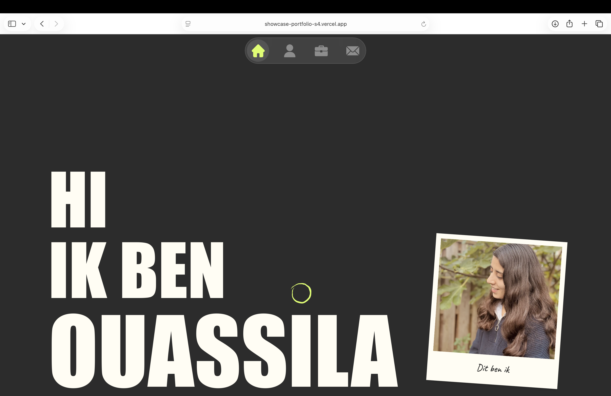
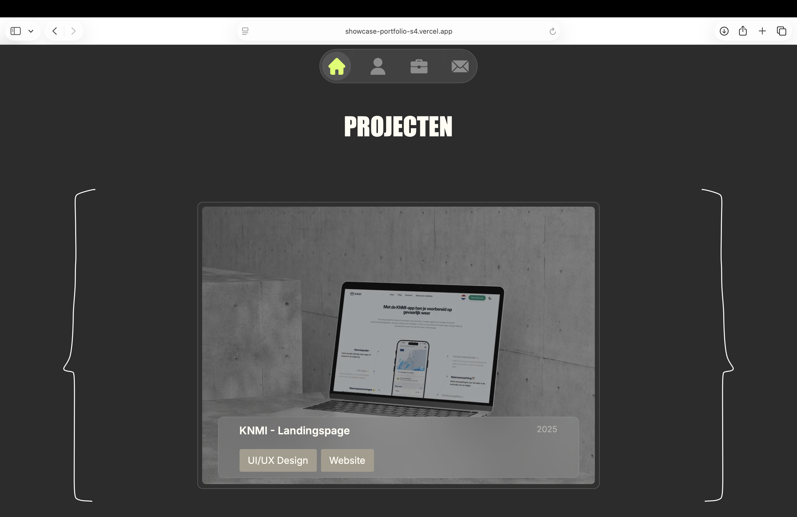
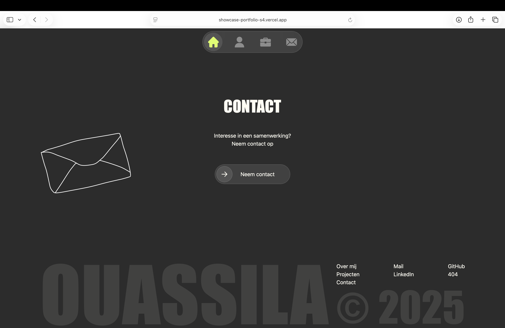

# Showcase Portfolio Semester 4

Dit project is een **persoonlijke portfolio website** waarin ik mijn werk, vaardigheden en projecten laat zien.

De website is gebouwd met Next.js (App Router) en Tailwind CSS.
Voor de backend heb ik Supabase gebruikt voor CRUD-functionaliteiten binnen de projecten-sectie.

- Een hero sectie
- Over mij pagina
- Projecten overzicht
- Contact sectie
- Custom UI componenten

Het doel van dit project is om mezelf professioneel te presenteren als **front-end / webdesigner** en mijn groei te tonen.

## Preview

<p>
  
  
  
</p>

## Tech stack


- Supabase (backend voor projecten: toevoegen, bewerken, verwijderen)

## Installatie

### 1. Dependencies installeren

```bash
npm install
```

### 2. Development server starten

```bash
npm run dev
```

Ga naar:
[http://localhost:3000](http://localhost:3000)

## Kleuren

-  `#2c2c2c`
-  `#fffdf3`
-  `#d9fe5a`
-  `#a49d8e`

## Mappenstructuur

```bash
├── app/
│   └── Next.js App Router pagina’s & layouts
│
├── components/
│   ├── home/
│   │   ├── Contact.tsx
│   │   ├── HeroSection.tsx
│   │   ├── OverMij.tsx
│   │   └── Projecten.tsx
│   │
│   └── layout/
│       ├── Header.tsx
│       └── Footer.tsx
│
├── ui/
│   ├── PolaroidCard.tsx
│   ├── ProjectButton.tsx
│   └── SchuifButton.tsx
│
├── lib/
│   └── supabase/
│       ├── client.ts
│       └── server.ts
│
├── public/
│   ├── fonts/
│   ├── icons/
│   └── illustrations/
│
└── node_modules/
```

## Live link

🔗 [https://showcase-portfolio-s4.vercel.app](https://showcase-portfolio-s4.vercel.app)

Deze link brengt je naar de online versie van mijn portfolio.

## Wat heb ik geleerd

- Werken met branches in Git
- CRUD-functionaliteiten bouwen voor projecten (toevoegen, bewerken, verwijderen)
- Code structureren
- Werken met ESLint & Lighthouse

## Reflectie

Tijdens de developmentfase van mijn showcase-portfolio heb ik bewust vanaf het
begin gelet op een duidelijke structuur in mijn code. Dit hielp mij om overzicht te
houden en sneller aanpassingen te maken wanneer dat nodig was.

Het werken met Git en branches ging goed. Door per feature in een aparte branch te
werken, kon ik veilig nieuwe functionaliteiten testen zonder de main branch te
verstoren.

Het bouwen van de backend voor de projecten-sectie met CRUD-functionaliteiten was leerzaam.
Ik heb geleerd hoe ik projecten kan toevoegen, bewerken en verwijderen via Supabase. Waardoor mijn
portfolio flexibeler werd.

Met tools zoals Lighthouse en ESLint heb ik mijn code gecontroleerd en verbeterd.
Hiermee kon ik fouten opsporen en de kwaliteit van mijn project verhogen.

In een volgend project wil ik deze tools eerder blijven inzetten om mijn codekwaliteit
te blijven verbeteren.

## Auteur

Ouassila  
Student ICT  
Fontys Hogescholen  
Semester 4
